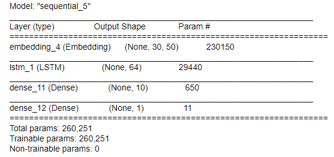

# AIDM7370 AI Theories and Applications Individual Report Assignment 

## Topic: Emotion Recognition

- Student Name: Luo Yifeng
- Student Id: 20448589

The simplest explanation of Emotion Recognition is that the computer basing on people's heart rate,  breathe, the way of people speak, or even facial expression these features to predict  the emotional state of people through a specific model or algorithm. The emotion Recognition is widely used in lots of situations like: Pilot emotion monitoring, student emotion monitoring and etc.

I think the two most famous applications of Emotion Recognition, one is the Emokit, which is the Kraken emotional computing engine. and the other is the Noldus Facial Expression Analysis System.  Compared with both Emokit and Noldus. I think the Emokit might be the better one. because when it comes to the performance of the model the more features we can get, the more chance that the high  performance of our model can get. Therefore, Emokit the Kraken emotional computing engine takes a wide range of data as the features from heart rate, breathe to facial expression to predict the emotional state of the people. When it comes to the model performance, the accuracy can be higher than the Noldus. Considering the Noldus only take people's facial expression as their features. Since both two applications source code are not open source so their data are not available for me to analyze.  So I did a small demo by myself about the emotion Recognition, using multiple approaches from  Logistic Regression to artificial neural network. All the code are available in my own GitHub: https://github.com/Andr3wis2Cool4School/text-classification/blob/main/code/text-classification.ipynb

### Datasets

For simplify this Emotion Recognition problem, instead of predict the people different emotions, I decide to make the output of my model to be 1 and 0 which stands for Positive emotion and Negative emotion. Convert the multi-classification problem to binary classification problem. The dataset are from three different resources.

- Amazon products review
- IMDB movies review
- yelp's review

All there datasets are labelled dataset.  

### Embedding

I used two different embeddings to covert sentences into numerical input.

- Bags-of-words model: The bag-of-words model is a simplifying representation used in natural language processing and information retrieval. In this model, a text is represented as the bag of its words, disregarding grammar and even word order but keeping multiplicity. The bag-of-words model has also been used for computer vision. 
- word2vec: Word2vec is a technique for natural language processing. The word2vec algorithm uses a neural network model to learn word associations from a large corpus of text. Once trained, such a model can detect synonymous words or suggest additional words for a partial sentence.

The output of the Bags-of-words model is used as the input for the Logistic  Regression model.

For the word2vec, I have used gensim package already train a 100 dims word vectors.  

### Logistic Regression model  

The propose of my demo is that I want to compare the difference performance between different model and see which model can get the better result. It is always great by using a logistic regression model as the start. Because the data were from three different sources, So I used logistic regression model train them separately. The results are in below:

From the result we can clearly see that the logistic regression model is doing either not very good or very bad job when it comes to the Emotion Recognition task. All accuracy for three datasets are nearly 80%. 

### Artificial neural network model

For Artificial neural network model, I have used three different types of neural network. 

#### First model(Flatten layer)

First model is a model with three hidden layers, the model summary is in below:

As it shows after the embedding layers which take the word vectors as the input, I used a flatten layer and 2 Dense layers. The accuracy and Loss for Training and Validation are in below:

It is clearly that the model is overfitting. But the result, I think is better than the logistic model. 

>  With adding the flatten layer we can convert the 3 dims vector from the embedding layers and than input into the Dense layers.

#### LSTM Model

LSTM(long short-term memory network) is a type of RNN.  By adding gates to RNN's memory cells fixing the problem of RNN can not remember things from long ago. 

The model summary is below:

 

The result after training:

The LSTM network result is better than any other model's result because RNN is for these kind of sequential data.  Although all the model are overfitting. 

# Conclusion 

As it is shown in this assignment, the LSTM network get the best performance when it comes to deal with the sequential data, but actually when it comes into practical situations. The data is not only sentences, it can be people's facial expression and heart rate etc. So what best model for Emotion recognition can be varies. Thus, all the model in this article are all overfitting, it can be prevent by using  L2 Regularization. All the models in this article are just demo. In real Emotion Recognition, It should be adding more layers. And actually the gradient descent in LSTM network is not as gentle as CNN, it is actually uneven, and it is Steep slope.  

